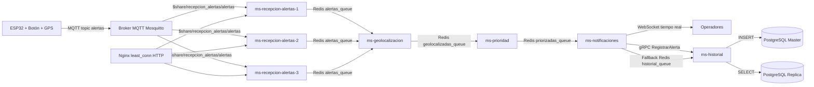

# 🚨 Sistema C5 - Alerta Ciudadana

Sistema distribuido de alerta ciudadana que simula la infraestructura de un centro de comando y control (C5). El sistema recibe alertas desde dispositivos físicos **ESP32** con botón de pánico, las procesa a través de **5 microservicios independientes** y notifica a operadores en tiempo real.

---

## Arquitectura



**Nota importante para la defensa**
- El balanceo de **alertas MQTT** se realiza en el broker por `shared subscriptions`.
- El `least_conn` de Nginx aplica al tráfico **HTTP** hacia `ms-recepcion-alertas-*`.

> **Diagrama detallado**: [docs/arquitectura.md](./docs/arquitectura.md)

---

## 🧭 Guía de Rúbrica (dónde está cada cosa)

Esta sección te sirve para explicar y demostrar cada criterio con evidencia concreta del repo.

| Criterio de rúbrica | Estado | Evidencia (archivo/ruta) | Qué mostrar en demo |
|---|---|---|---|
| Diagrama de arquitectura | ✅ | `docs/arquitectura.md`, diagrama Mermaid en este README | Flujo completo ESP32 → operador → historial |
| ADRs (≥3) con justificación | ✅ | `docs/adr/ADR-001-comunicacion-grpc.md`, `ADR-002-consistencia-postgresql.md`, `ADR-003-redis-colas.md` | Contexto, alternativas y decisión en cada ADR |
| 5 microservicios funcionales | ✅ | `services/ms-recepcionAlertas`, `ms-geolocalizacion`, `ms-prioridad`, `ms-notificaciones`, `ms-historial` | Logs de paso por cada microservicio |
| gRPC + contrato .proto | ✅ | `services/ms-historial/proto/historial.proto`, `services/ms-notificaciones/grpc/client.js`, `services/ms-historial/grpc/server.js` | Registro por gRPC y fallback si falla |
| Tolerancia a fallos (notificaciones) | ✅ | `services/ms-notificaciones/models/notificacionModel.js`, colas Redis `failed_notifications_queue` y `historial_queue` | Parar `ms-notificaciones`, enviar alertas, reiniciar y ver entrega |
| Balanceo 3 instancias recepción | ✅* | `docker-compose.yml` (3 instancias), `services/ms-recepcionAlertas/index.js` (`$share/...`), `nginx/nginx.conf` (`least_conn` HTTP) | Logs en 3 instancias + explicación shared subscription |
| Replicación y consistencia | ✅ | `docker-compose.yml` (`postgres-master`/`postgres-replica`), `services/ms-historial/models/alertaDbModel.js` (write master/read replica), ADR-002 | Query de replicación + consulta historial desde réplica |
| REST documentado con OpenAPI | ✅ | `docs/openapi.yaml` | Abrir archivo y mapear endpoints usados |
| Sistema levanta con un comando | ✅ | `docker-compose.yml`, `.env.example` | `docker-compose up --build` |
| README claro y reproducible | ✅ | `README.md` | Seguir sección Inicio Rápido |

\* Para evitar discusión: explica explícitamente que el reparto de alertas MQTT no lo hace Nginx sino el broker MQTT con shared subscription.

### Stack Tecnológico

| Componente | Tecnología |
|---|---|
| Dispositivo | ESP32 (Arduino) |
| Protocolo IoT | MQTT (Eclipse Mosquitto) |
| Bus de mensajes | Redis (listas FIFO) |
| Comunicación inter-servicio | gRPC (ms-notificaciones → ms-historial) |
| Notificaciones real-time | WebSockets |
| Persistencia | PostgreSQL 14 (Maestro + Réplica) |
| Balanceo de carga | Nginx (least_conn, 3 instancias) |
| Contenedores | Docker + Docker Compose |

---

## Microservicios

| # | Servicio | Puerto | Responsabilidad |
|---|---|---|---|
| 1 | ms-recepcionAlertas (×3) | interno 3001 | Suscripción MQTT, validación, encolado Redis |
| 2 | ms-geolocalizacion | 3002 | Geocoding inverso (coordenadas → dirección) |
| 3 | ms-prioridad | 3003 | Clasificación: crítica / alta / media |
| 4 | ms-notificaciones | 3004 | WebSocket a operadores + cliente gRPC |
| 5 | ms-historial | 3005 (HTTP) / 50051 (gRPC) | Persistencia PostgreSQL + API consulta |

> `ms-prioridad` también realiza **asignación automática de unidades de respuesta** (patrulla/ambulancia/bomberos) por prioridad + tipo de emergencia.

---

## Prerrequisitos

- **Docker Desktop** (incluye Docker Compose): [Instalar](https://docs.docker.com/get-docker/)
- **Git**: Para clonar el repositorio

Para el ESP32 (opcional para demo):
- **Arduino IDE 2.x**: [Descargar](https://www.arduino.cc/en/software)
- Librerías: `PubSubClient`, `ArduinoJson`

---

## Inicio Rápido

### 1. Clonar y configurar

```bash
git clone <URL-del-repositorio>
cd Eavisos

# Windows (PowerShell)
Copy-Item .env.example .env

# Linux/macOS
cp .env.example .env
```

El archivo `.env` ya tiene valores por defecto funcionales. No requiere modificación para la demo.

### 2. Levantar el sistema completo

```bash
docker-compose up --build
```

Este comando levanta **todos los servicios** con un solo comando:
- `mqtt-broker` (Mosquitto)
- `redis`
- `postgres-master` + `postgres-replica`
- `ms-recepcion-alertas-1`, `ms-recepcion-alertas-2`, `ms-recepcion-alertas-3`
- `ms-geolocalizacion`, `ms-prioridad`, `ms-notificaciones`, `ms-historial`
- `nginx-balancer`

La primera vez puede tardar 3-5 minutos descargando imágenes.

### 3. Verificar que todo está activo

```bash
# Ver todos los contenedores corriendo
docker-compose ps

# Ver logs de un servicio específico
docker-compose logs -f ms-notificaciones
```

---

## Probar el Sistema

### Paso 1: Conectarse como Operador (WebSocket)

Abre un cliente WebSocket (ej: [Simple WebSocket Client](https://chrome.google.com/webstore/detail/simple-websocket-client/pfdhoblngboilpfeibdedpjgfnlcodoo)) y conecta a:

```
ws://localhost:3004
```

Recibirás la confirmación:
```json
{
  "tipo": "conexion_establecida",
  "mensaje": "Conectado al Centro de Comando C5. Esperando alertas...",
  "timestamp": "2024-06-09T..."
}
```

Opcional: abre `frontend/index.html` para usar el panel web de operador (muestra prioridad, tipo de emergencia, geolocalización y unidades asignadas).

### Interfaz web (panel de operador)

- Archivo: `frontend/index.html`
- Conexión en tiempo real: `ws://localhost:3004`
- Muestra por alerta:
  - `ID_dispositivo`
  - `tipo_emergencia`
  - `prioridad` + `prioridad_fuente`
  - coordenadas + indicador GPS real/respaldo
  - geolocalización enriquecida
  - unidades de respuesta asignadas

### Paso 2: Enviar una Alerta desde ESP32 (o simulada)

#### Opción A: Con ESP32 físico
Ver [esp32/README.md](./esp32/README.md) para instrucciones completas de hardware y configuración.

#### Opción B: Simular con cliente MQTT (MQTTX o mosquitto_pub)

Conectar al broker en `localhost:1883` y publicar en el topic `alertas`:

```json
{
  "ID_dispositivo": "ESP32-001",
  "coordenadas": {
    "lat": 19.432608,
    "lon": -99.133209
  },
  "timestamp": "2024-06-09T10:00:00Z",
  "tipo_emergencia": "incendio"
}
```

**Usando mosquitto_pub (si está instalado):**
```bash
mosquitto_pub -h localhost -p 1883 -t alertas -m '{"ID_dispositivo":"ESP32-001","coordenadas":{"lat":19.432608,"lon":-99.133209},"timestamp":"2024-06-09T10:00:00Z","tipo_emergencia":"incendio"}'
```

**Tipos de emergencia válidos:**
`incendio` | `accidente grave` | `emergencia médica` | `robo` | `asalto` | `violencia` | `actividad sospechosa` | `vandalismo` | `panico` | `otro`

### Paso 3: Verificar el flujo en logs

```bash
docker-compose logs -f
```

Verás la alerta pasar por cada microservicio:
```
ms-recepcion-alertas-1  | [MQTT] Mensaje recibido en 'alertas'
ms-recepcion-alertas-1  | [Redis] Alerta de ESP32-001 encolada en 'alertas_queue'.
ms-geolocalizacion      | [Worker] Alerta recibida: ESP32-001
ms-geolocalizacion      | [Geo] Alerta ESP32-001 → Col. Centro, Ciudad de México...
ms-prioridad            | [Worker] Prioridad 'crítica' asignada a ESP32-001
ms-notificaciones       | [Worker] Alerta enviada a 1 operadores vía WebSocket.
ms-notificaciones       | [gRPC Client] Alerta registrada en historial. id_db=1
ms-historial            | [gRPC] Alerta ESP32-001 guardada con id: 1
```

### Paso 4: Respuesta en el operador (WebSocket)

```json
{
  "ID_dispositivo": "ESP32-001",
  "coordenadas": { "lat": 19.432608, "lon": -99.133209 },
  "timestamp": "2024-06-09T10:00:00Z",
  "tipo_emergencia": "incendio",
  "geolocalizacion": {
    "direccion": "Zócalo, Centro Histórico, Ciudad de México",
    "pais": "México",
    "ciudad": "Ciudad de México",
    "estado": "Ciudad de México",
    "codigoPostal": "06000"
  },
  "prioridad": "crítica"
}
```

---

## API del Sistema

### Historial de Alertas (ms-historial, puerto 3005)

```bash
# Todas las alertas (lee desde réplica)
GET http://localhost:3005/api/historial

# Filtrar por prioridad
GET http://localhost:3005/api/historial?prioridad=crítica

# Filtrar por zona (ciudad)
GET http://localhost:3005/api/historial?zona=México

# Filtrar por rango de fechas
GET http://localhost:3005/api/historial?fecha_inicio=2024-06-01&fecha_fin=2024-06-10

# Alerta específica por ID
GET http://localhost:3005/api/historial/1
```

### Health Checks

```bash
GET http://localhost:8080/api/health          # ms-recepcion (via nginx)
GET http://localhost:3004/api/health          # ms-notificaciones
GET http://localhost:3005/api/health          # ms-historial
```

### Estadísticas en tiempo real

```bash
GET http://localhost:3004/api/stats           # Operadores conectados, colas
GET http://localhost:3004/api/operadores      # Solo operadores WS activos
```

### Reglas de prioridad

```bash
GET http://localhost:3003/api/reglas          # Reglas de clasificación
```

### Documentación OpenAPI (REST)

- Archivo: `docs/openapi.yaml`
- Cubre endpoints REST de health/stats/reglas/notificaciones/historial.
- El canal gRPC se documenta en `services/ms-historial/proto/historial.proto`.

---

## Comunicación gRPC

Un requisito del sistema es que al menos un servicio use **gRPC** con contrato documentado.

**Contrato**: `services/ms-historial/proto/historial.proto`

```protobuf
service AlertaService {
  rpc RegistrarAlerta (AlertaRequest) returns (AlertaResponse);
  rpc HealthCheck (HealthRequest) returns (HealthResponse);
}
```

**Flujo**: `ms-notificaciones` (cliente gRPC) → `ms-historial` (servidor gRPC en puerto 50051)

> Ver [ADR-001](./docs/adr/ADR-001-comunicacion-grpc.md) para la justificación de esta decisión.

---

## Tolerancia a Fallos

### Demostración en vivo

**1. Caída de ms-notificaciones:**
```bash
docker-compose stop ms-notificaciones
# Las alertas MQTT siguen siendo procesadas y encoladas en Redis
# Al reiniciar, ms-notificaciones retoma desde la cola
docker-compose start ms-notificaciones
```

**2. Sin operadores WebSocket:**
- Las alertas se almacenan en `failed_notifications_queue`
- Al reconectarse un operador, se reenvían automáticamente cada 5 segundos

**3. Caída del gRPC de ms-historial:**
- ms-notificaciones encola en `historial_queue` (Redis fallback)
- ms-historial consume la cola cuando se recupera

**4. Verificar colas Redis:**
```bash
docker exec redis redis-cli llen alertas_queue
docker exec redis redis-cli llen failed_notifications_queue
docker exec redis redis-cli llen historial_queue
```

---

## Balanceo de Carga

El sistema usa dos mecanismos complementarios:

- **MQTT (alertas entrantes):** el broker reparte mensajes entre 3 instancias con `shared subscription`.
- **HTTP:** Nginx balancea con `least_conn` hacia `ms-recepcion-alertas-1/2/3`.

Para validar distribución de alertas MQTT entre las 3 instancias:

```bash
# Escalar a más instancias (ejemplo: 5)
docker-compose up --scale ms-recepcion-alertas-1=1 \
                  --scale ms-recepcion-alertas-2=1 \
                  --scale ms-recepcion-alertas-3=1

# Ver distribución de carga
docker-compose logs ms-recepcion-alertas-1 ms-recepcion-alertas-2 ms-recepcion-alertas-3
```

---

## Replicación PostgreSQL

```bash
# Verificar estado de replicación
docker exec postgres-master psql -U user -d sistema_alertas \
  -c "SELECT * FROM pg_stat_replication;"

# Verificar lag de replicación
docker exec postgres-replica psql -U user -d sistema_alertas \
  -c "SELECT now() - pg_last_xact_replay_timestamp() AS replication_lag;"

# Consultar desde la réplica directamente
docker exec postgres-replica psql -U user -d sistema_alertas \
  -c "SELECT COUNT(*) FROM alertas;"
```

> Ver [ADR-002](./docs/adr/ADR-002-consistencia-postgresql.md) para la justificación del modelo de consistencia eventual.

---

## Estructura del Proyecto

```
Eavisos/
├── docker-compose.yml          # Orquestación de todos los servicios
├── .env.example                # Variables de entorno (copiar a .env)
├── nginx/
│   └── nginx.conf              # Balanceo de carga (least_conn, 3 instancias)
├── mosquitto/
│   └── config/mosquitto.conf  # Configuración del broker MQTT
├── postgres/
│   └── init/01-init-replication.sql  # Init de replicación
├── services/
│   ├── ms-recepcionAlertas/
│   │   ├── index.js            # Entry point: MQTT + arranque
│   │   ├── routes/alertasRoutes.js   # GET /health, /tipos, /stats
│   │   ├── models/alertaModel.js     # Validación y normalización
│   │   ├── package.json
│   │   └── Dockerfile
│   ├── ms-geolocalizacion/
│   │   ├── index.js            # Entry point: worker + HTTP
│   │   ├── routes/geoRoutes.js
│   │   ├── models/geoModel.js  # Geocoding inverso
│   │   ├── package.json
│   │   └── Dockerfile
│   ├── ms-prioridad/
│   │   ├── index.js
│   │   ├── routes/prioridadRoutes.js
│   │   ├── models/prioridadModel.js  # Reglas de negocio
│   │   ├── package.json
│   │   └── Dockerfile
│   ├── ms-notificaciones/
│   │   ├── index.js            # Entry point: WS + gRPC client + worker
│   │   ├── routes/notificacionesRoutes.js
│   │   ├── models/notificacionModel.js   # Broadcast + retry
│   │   ├── grpc/client.js      # Cliente gRPC → ms-historial
│   │   ├── proto/historial.proto
│   │   ├── package.json
│   │   └── Dockerfile
│   └── ms-historial/
│       ├── index.js            # Entry point: gRPC server + Redis worker + HTTP
│       ├── routes/historialRoutes.js    # GET /historial (con filtros)
│       ├── models/alertaDbModel.js      # Pool maestro/réplica
│       ├── grpc/server.js      # Servidor gRPC AlertaService
│       ├── proto/historial.proto        # Contrato gRPC (fuente de verdad)
│       ├── package.json
│       └── Dockerfile
├── esp32/
│   ├── main/main.ino           # Firmware Arduino ESP32
│   └── README.md               # Guía de conexión y configuración
└── docs/
    ├── arquitectura.md         # Diagrama y descripción del sistema
    └── adr/
        ├── ADR-001-comunicacion-grpc.md
        ├── ADR-002-consistencia-postgresql.md
        └── ADR-003-redis-colas.md
```

---

## Detener el Sistema

```bash
# Detener todos los contenedores
docker-compose down

# Detener Y eliminar volúmenes (BORRA los datos de DB y Redis)
docker-compose down -v
```

---

## Decisiones de Arquitectura (ADRs)

| ADR | Título | Estado |
|---|---|---|
| [ADR-001](./docs/adr/ADR-001-comunicacion-grpc.md) | Comunicación gRPC entre ms-notificaciones y ms-historial | Aceptada |
| [ADR-002](./docs/adr/ADR-002-consistencia-postgresql.md) | Consistencia Eventual en PostgreSQL | Aceptada |
| [ADR-003](./docs/adr/ADR-003-redis-colas.md) | Redis como Bus de Mensajes FIFO | Aceptada |
